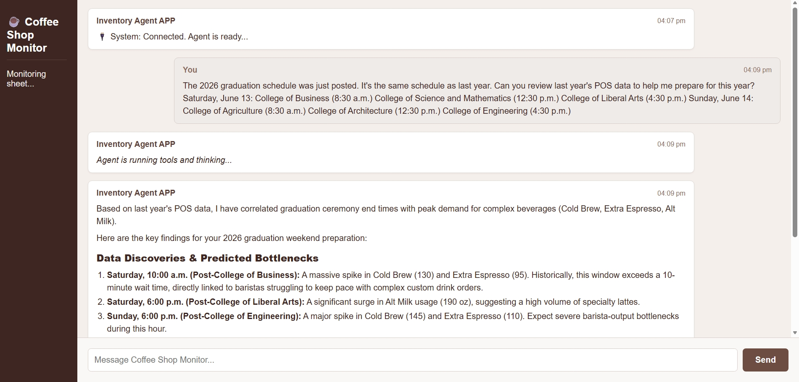

# ☕ Coffee Shop Agent (Manager Assistant)

A **Google ADK** business-analyst agent for a coffee shop manager. It correlates last year's POS sales data with this year's event schedule to predict demand spikes and staffing bottlenecks, then — with explicit human approval — writes the resulting action items straight into a Google Sheet TODO list.

**🔗 Live demo:** [coffee-mgr-agent-545646377190.us-central1.run.app](https://coffee-mgr-agent-545646377190.us-central1.run.app/)



## Features

- 🤖 `LlmAgent` ("secure_coding_assistant") built on Google ADK, served through a custom **FastAPI** app instead of the default ADK web UI
- 💬 Real-time chat over a **WebSocket** (`/ws`), plus a stateless `POST /chat` fallback endpoint
- 🎨 Self-contained, coffee-themed HTML/CSS chat interface served directly from the FastAPI backend (Markdown rendering via `marked.js`, no build step)
- 📊 Reads historical POS data from Google Sheets and correlates 2025 product/wait-time spikes with this year's event schedule to predict 2026 bottlenecks
- 🧠 Runs a scripted diagnostics playbook to distinguish cashier shortages from barista/fulfillment bottlenecks and recommend the right staffing fix
- 🛑 **Human-in-the-loop by design** — the agent must present findings and get explicit manager approval before writing anything to the spreadsheet
- 📝 On approval, auto-creates a `TODO-2026` sheet tab (if missing) and appends structured tasks (Task, Category, Ceremony, Date_Added)
- 🖥️ Executes arbitrary shell/Python analysis scripts through a sandboxed subprocess tool, with a local-mode fallback when no sandbox binary is present

## Tech Stack

| Layer | Technology |
|---|---|
| Backend | [FastAPI](https://fastapi.tiangolo.com/) + WebSockets |
| Agent framework | [Google ADK](https://google.github.io/adk-docs/) (`LlmAgent`, `App`, `Runner`, `InMemorySessionService`) |
| LLM | Gemini (`gemini-3.1-flash-lite`, configurable via `GEMINI_MODEL`) |
| Data source | Google Sheets (POS history + generated TODO list) via `googleapiclient` |
| Auth | Google Application Default Credentials (ADC) |
| Frontend | Vanilla HTML/CSS/JS chat UI, Markdown rendering via `marked.js` (CDN) |
| Hosting | Google Cloud Run (`us-central1`), containerized with Docker |

## How It Works

1. The manager opens the chat UI (served at `/`) and pastes this year's graduation-ceremony schedule.
2. The agent calls `read_spreadsheet_values` to pull last year's `POS-2025` data from the configured spreadsheet, then uses `execute_sandbox_command` to run a Python script correlating 2025 product spikes (Cold Brew, Alt Milk, Extra Espresso) and wait times with the ceremonies that caused them.
3. It maps that pattern onto the new schedule to predict when/where 2026 spikes will occur, and applies a fixed diagnostics playbook (cashier shortage vs. barista/fulfillment bottleneck) to recommend staffing or stocking changes.
4. It presents two or three key findings as a clean task list and explicitly asks: *"Would you like me to add these tasks to your 'TODO-2026' TODO list?"* — no spreadsheet writes happen before this point.
5. On approval, it calls `create_spreadsheet_tab` (if `TODO-2026` doesn't exist yet) and `update_spreadsheet_values` to append the approved tasks, then confirms exactly what was written.

```
Manager (chat/WS) → FastAPI /ws → ADK Runner → secure_coding_assistant (Gemini)
                                                        │
                          ┌─────────────────────────────┼─────────────────────────────┐
                          ▼                              ▼                              ▼
              read_spreadsheet_values        execute_sandbox_command          create_spreadsheet_tab /
              (POS-2025 history)          (Python correlation analysis)       update_spreadsheet_values
                          │                              │                    (only after manager approval)
                          └──────────────► Findings + recommendations ◄────────────────┘
                                                        │
                                                        ▼
                                          Chat UI (Markdown-rendered response)
```

## Project Structure

```
coffee-mgr-agent/
├── main.py            # FastAPI app: ADK agent, tools, WS/HTTP endpoints, chat UI
├── requirements.txt    # Python dependencies
└── Dockerfile          # Container build for Cloud Run
```

## Getting Started

### Prerequisites

- Python 3.11+
- A Google Cloud project with the **Google Sheets API** enabled
- Application Default Credentials configured locally, with access to your target spreadsheet:
  ```bash
  gcloud auth application-default login
  ```
- A Google Spreadsheet containing a `POS-2025` tab with historical sales/wait-time data

### 1. Clone the repo

```bash
git clone https://github.com/Codsach/coffee-mgr-agent.git
cd coffee-mgr-agent
```

### 2. Install dependencies

```bash
python -m venv venv
source venv/bin/activate   # Windows: venv\Scripts\activate
pip install -r requirements.txt
```

### 3. Configure environment variables

```bash
export SPREADSHEET_ID="your-google-sheet-id"
export GEMINI_MODEL="gemini-3.1-flash-lite"   # optional override
```

### 4. Run locally

```bash
uvicorn main:app --host 0.0.0.0 --port 8080
```

Open `http://localhost:8080` for the chat UI.

## Deployment

The live demo runs on **Google Cloud Run** in `us-central1`, built from the included `Dockerfile`:

```bash
gcloud run deploy coffee-mgr-agent \
  --source . \
  --region us-central1 \
  --set-env-vars SPREADSHEET_ID=your-google-sheet-id \
  --allow-unauthenticated
```

## Safety Note

The agent's `execute_sandbox_command` tool can run arbitrary shell/Python commands, and its spreadsheet-write tools can modify real data. The system instruction enforces a strict **human-in-the-loop approval gate** before any write happens — do not remove that check if you deploy this with write access to a production spreadsheet.

## License

No license specified yet — add one (e.g. MIT) if you intend this to be open source.

## Author

Built by [Sachin R](https://github.com/Codsach) — [Portfolio](https://sachinr.vercel.app) · [LinkedIn](https://linkedin.com/in/sachin-r-b737a7393)
